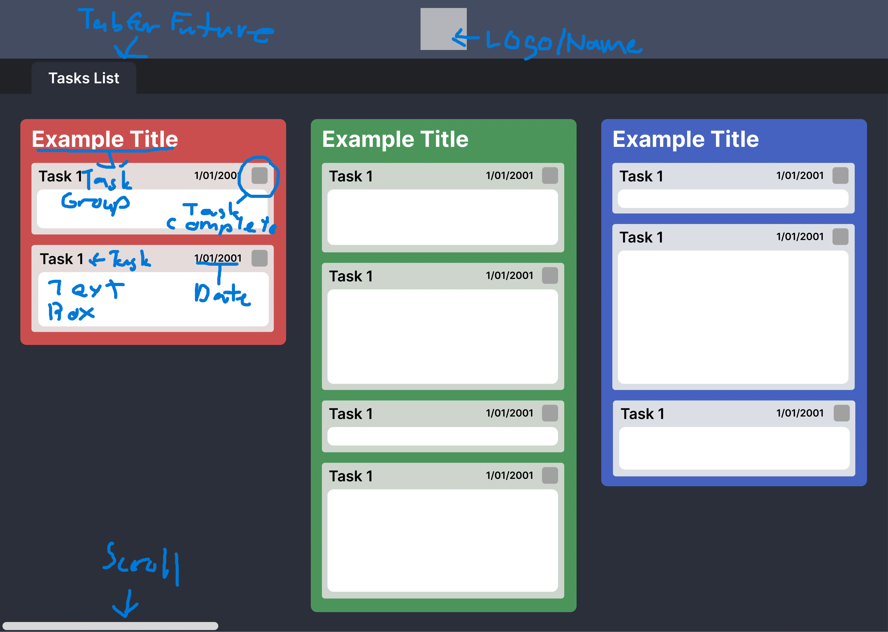

# Initial Designs

Horizontal Layout: 

Notes are on image with the unmarked image saved in folder for future reference. The design is simple with basic functionality to note when something is finished with a toggle and groups for different types tasks.

Vertical Layout:

Same specifications as the first layout only in a vertical format rather than horizontal.

