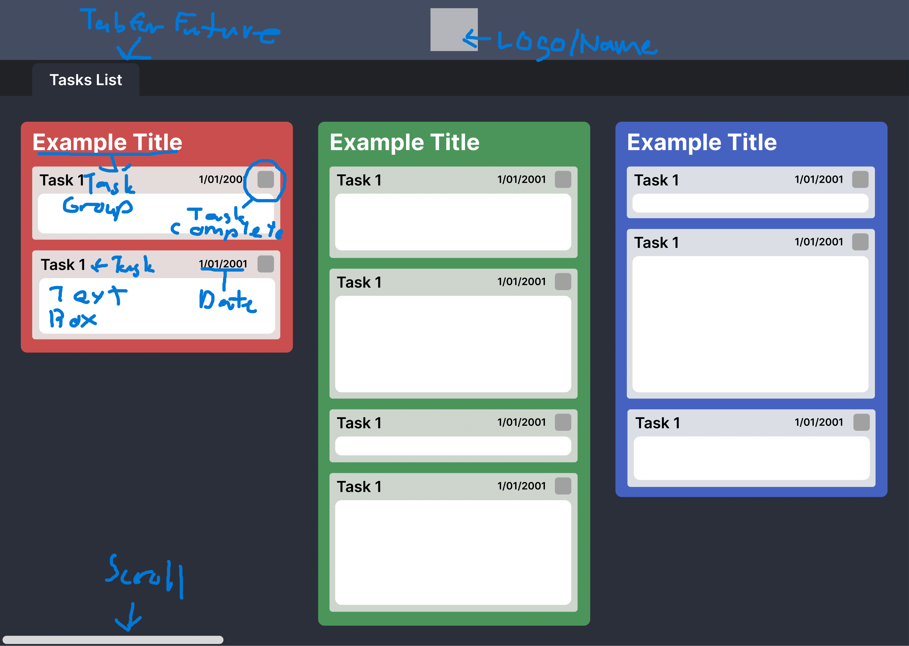
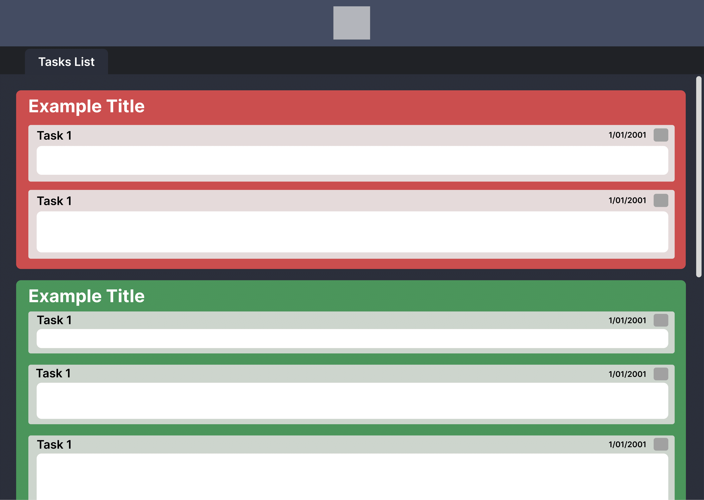
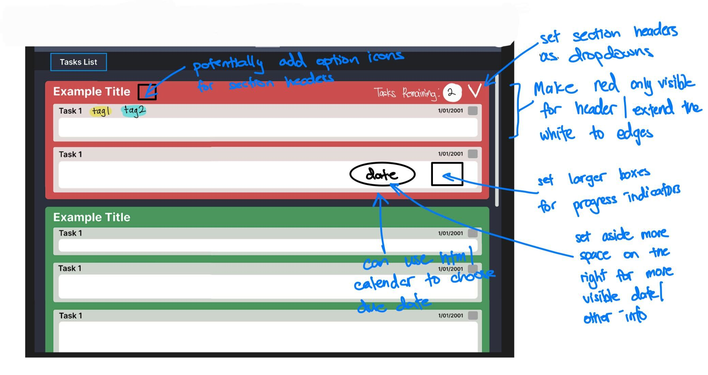
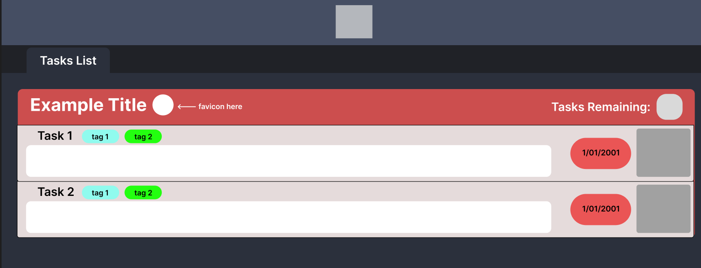

# Initial Designs

Horizontal Layout:

Notes are on image with the unmarked image saved in folder for future reference. The design is simple with basic functionality to note when something is finished with a toggle and groups for different types tasks.

Vertical Layout:

Same specifications as the first layout only in a vertical format rather than horizontal.

Vertical Layout - Annotated/Changes:

Additional Notes:

- Generally space to the right should be used to allocate important information such as Date, Progress and others(links, etc).
- Font and styling should be in our team's (Quantumm Leap) signature font and styling.
- Colors will also be changed to a darker and purplish theme to match the team aesthetic.

Vertical Layout Revised from Annotated:  

- Below is the visualization of the annotated version. Colors and Fonts would be better tested later.
- **IMPORTANT:** The spacing of elements such as the Task 1 header, tags and potentially other elements are quite cramped so in CSS experiment with different margins to see which is the most breathable format.
